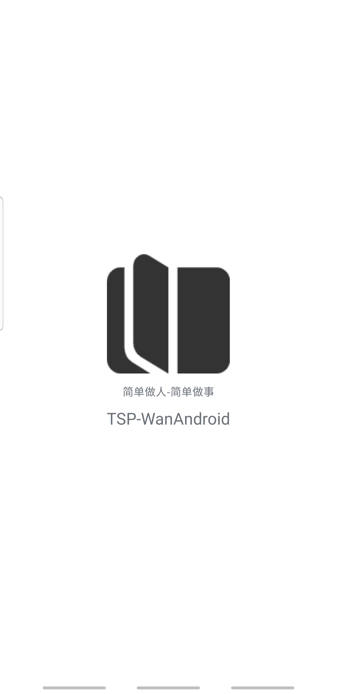
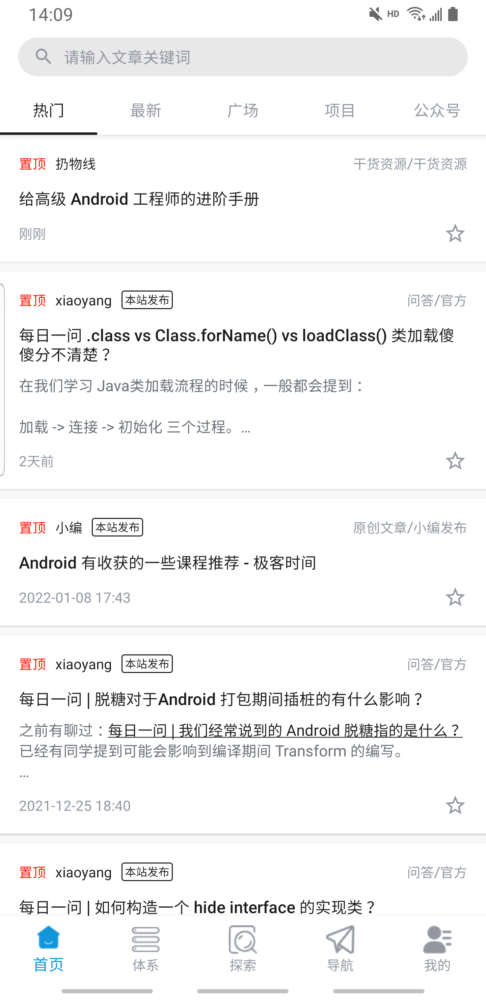
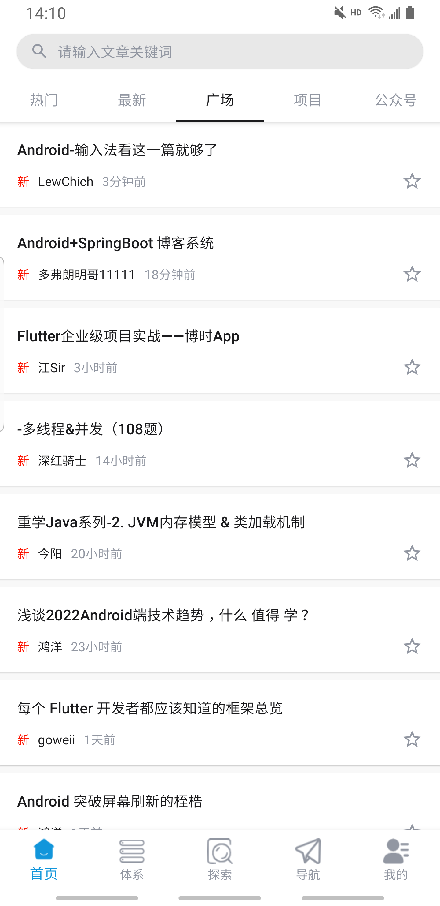
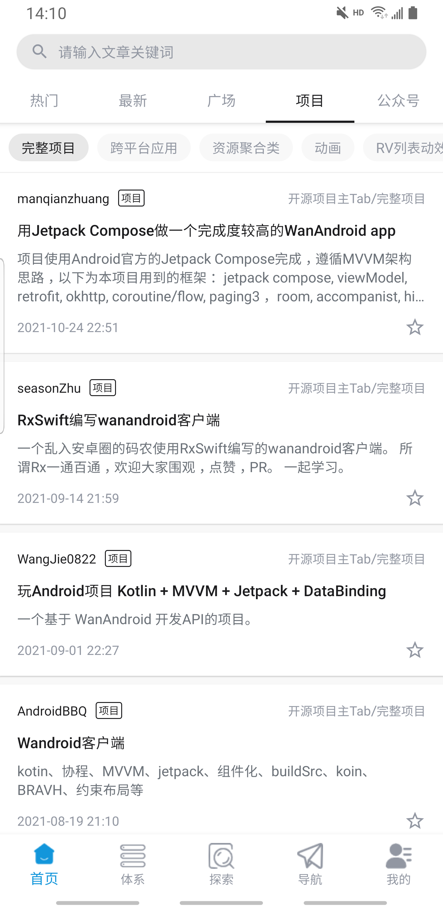
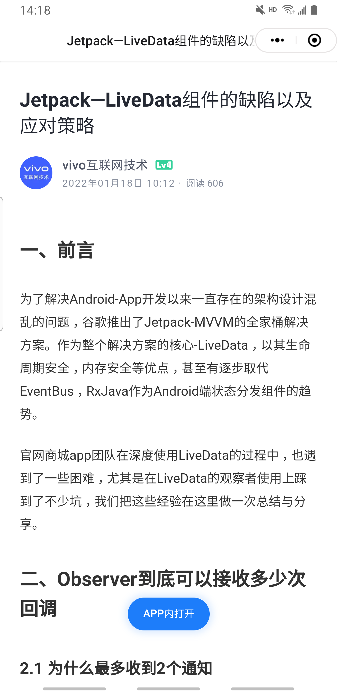
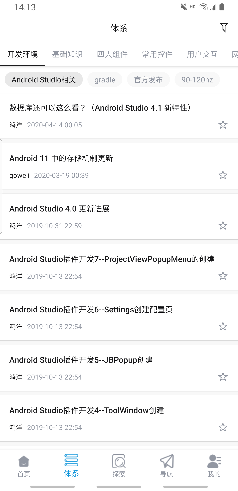
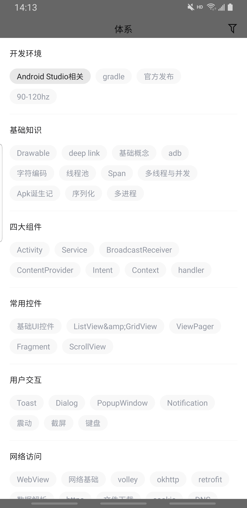
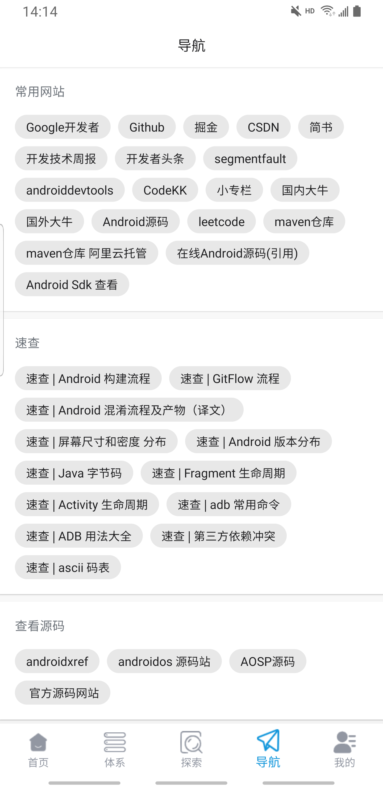
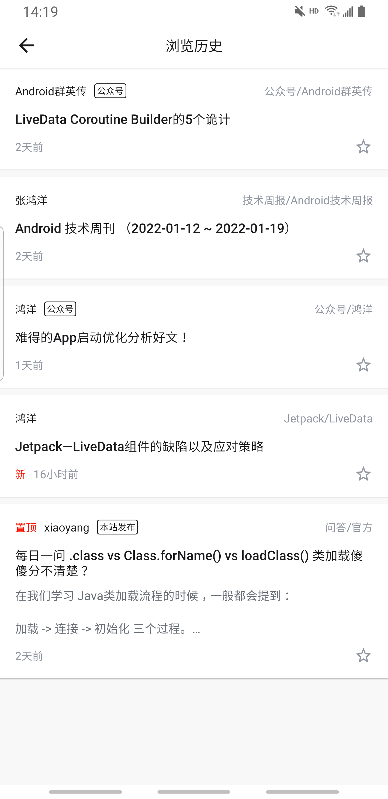
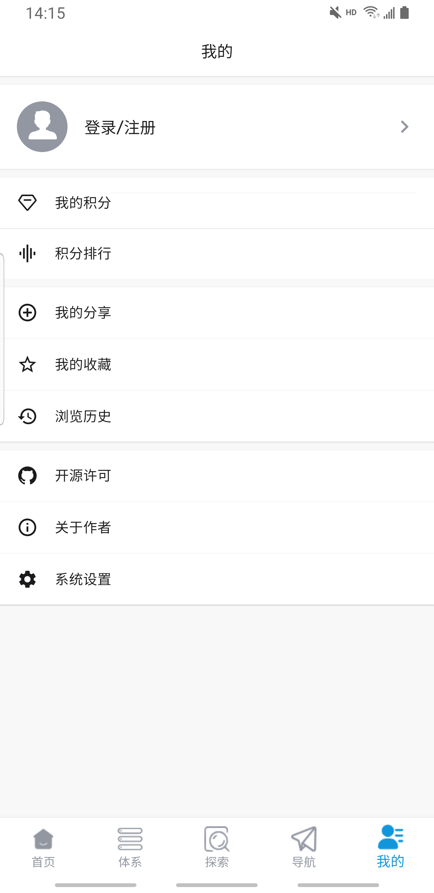

## 前言

​		学习的最好方式就是动手实践，为了加深 Kotlin 及 JetPack 的学习理解及巩固，在参考了鸿洋大神的玩安卓社区后，借助社区API完成了玩安卓客户端的V1.0.0 版本的开发，将JetPack的主要组件引用到项目中，相比如纯Java开发有更多的好处和优势。

## 简介

​		Wandroid项目基于 Kotlin + JetPack + 协程实现 MVVM 架构的玩安卓App。网络请求基于 Retrofit + okhttp + 协程，数据库采用 room，事件总线LiveEventBus等完成整个项目的开发，后续会进一步将JetPack的其它框架引入到项目中。

## 项目截图

|    |    |    |    |
| ----------------------- | ----------------------- | ----------------------- | ----------------------- |
|  |    |    |  |
|  |  |  |  |
|                         |                         |                         |                         |

## 已实现功能

- 首页、体系、发现、导航、我的五大模块；
- 登录注册功能，浏览历史记录，搜索(历史搜索，热门搜索)；
- 博客文章浏览及分享，添加收藏、取消收藏；
- 切换夜间模式，设置文章字体大小；
- 我的积分、积分排行榜功能；

## 技术点

- [Retrofit](https://github.com/square/retrofit) + [协程](https://github.com/Kotlin/kotlinx.coroutines) + [ViewModel](https://developer.android.com/topic/libraries/architecture/viewmodel) + [LiveData](https://developer.android.com/topic/libraries/architecture/livedata) 完成数据请求;
- 封装了基类Fragment，Activity，ViewModel 用于处理一些通用逻辑;
- 应用[LiveDataBus](https://github.com/JeremyLiao/LiveEventBus)用于全局消息分发及监听;
- 基于 [Room](https://developer.android.com/jetpack/androidx/releases/room) 来记录浏览记录；
- 基于[SwipeRefreshLayout](https://developer.android.com/jetpack/androidx/releases/swiperefreshlayout)+[BaseRecyclerViewAdapterHelper](https://github.com/CymChad/BaseRecyclerViewAdapterHelper)实现列表的下拉刷新和上拉加载；
- 使用 [TabLayout](https://developer.android.com/reference/com/google/android/material/tabs/TabLayout)+[ViewPager](https://developer.android.com/training/animation/screen-slide)+Fragment实现顶部导航布局；
- 使用 [FlowLayout](https://github.com/hongyangAndroid/FlowLayout) 实现流式布局；
- 博客详情加载基于 [AgentWeb](https://github.com/Justson/AgentWeb)；
- TODO
    - 引入Paging框架用于数据分页加载；
    - 学习 Hilt 注入框架并应用到项目中;

## 版本记录

**v1.0.0**

- 初始化版本，主要功能都已经完成。

